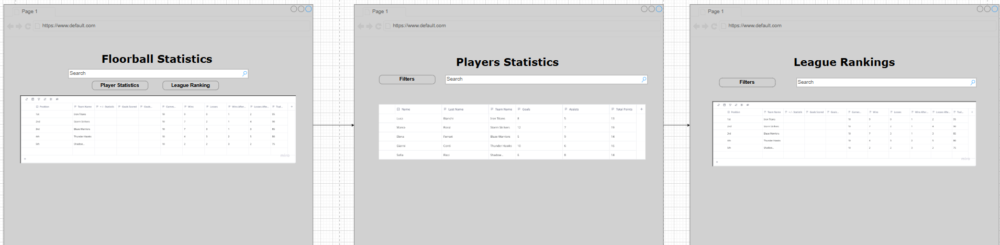

# Floorball_Statistics_Project 


[](http://www.apache.org/licenses/LICENSE-2.0.html)


#### Contents:
- [Analysis](#analysis)
  - [Scenario](#scenario)
  - [User Stories](#user-stories)
  - [Use Case](#use-case)
- [Design](#design)
  - [Prototype Design](#prototype-design)
  - [Domain Design](#domain-design)
  - [Business Logic](#business-logic)
- [Implementation](#implementation)
  - [Backend Technology](#backend-technology)
  - [Frontend Technology](#frontend-technology)
- [Project Management](#project-management)
  - [Roles](#roles)
  - [Milestones](#milestones)

## Analysis

### Scenario

The Floorball-Statistics project is about displaying key information about the Swiss floorball league. 
Our main goal with this web application is to display all the relevant stats of teams and players, 
which are needed for teams to prepare for their upcoming games. The application offers filtered and ranked views of player and team performance, with full data editing capabilities for administrators.

### User Stories
- As a user, I want to view the player stats and see how they are ranked against eachother.
- As a user, I want to see the teams and see how they are ranked against eachother.
- As a user, I want to be able to filter and sort the data.
- As an Admin, I want to edit and manage the various data.
- As an Admin, I want the website layout to be structured and easy to follow.
- As an Admin, I want the website to be mainly accessible through desktop.

### Use Case

We created detailed use case diagrams for each of the three main views in the system. These diagrams define how users and admins interact with the system:

### Use Case 100:

Shows the users available actions for the home page


### Use Case 200:
Shows the users available actions for the player page


### Use Case 300:
Shows the users available actions for the League page


## Design

Our frontend is designed with usability and clarity in mind. We follow a minimalist layout that supports: 

- Dark, readable typography
- Button-based navigation
- Responsive table components
- Input fields for filtering and search

The layout is consistent across screens and follows a clear hierarchy for users and admins.

The general idea of the design was to have the first few screens be accessible for everyone with the main focus on the data display. All other screens are only accessible to the admins on which a bit more administrative tasks can be done.

### Wireframe

The following wireframes define the structure and layout of the three views: Home, Player and League. 
Each wireframe outlines the major UI elements such as filters, search bar, data tables and navigation bar.



### Prototype

A general prototype was never really made and documented because in the view of the developers the created wireframe gave enough of a vision how the frontend should also look like. Still these points were discussed and written down as attributes the frontend should definitely have:

- Being able to navigate between home, player, league and login screen
- Displaying and sorting data in tables
- Using filters and search to dynamically refine results
- After getting access to the dashboard screen, being able to delete, edit and create more data for players and teams to be able to display in the tables

### Domain Design

The domain model is implemented using JPA entities in the package `ch.fhnw.pizza.data.domain`.

We modeled the core entities based on a real-worlds floorball league structure. The relationships between **Player**, **Team**, **League** and **Ranking** follow standard realtional logic.


### Development Modifications

During the development process, we realized that the ranking entity was unnecessary for supporting the logic of our web service on both the backend and frontend. This is because Budibase already allows us to sort data based on the total points of a player or team, effectively generating the rankings automatically.

### Business Logic 

We implemented the business logic in the `ch.fhnw.pizza.business.service` package. Each service class handels the core application logic for its respective entitity.

Below is an example of the business logic for managing player data. 

### PlayerService

This service provides full CRUD operations for `Player` objects, including logic to update only provided fields:

- **GET** `/api/players`
  -> returns all players in the system

- **GET** `/api/players/{id}`
  -> returns one player by ID.
  -> Throws a runtime exception if the ID does not exist.

- **POST** `/api/players`
  -> Adds a new player to the system.  
  -> Validates inpnut.

- **PUT** `/api/players/{id}`
  -> Updates an existing player.
  -> Only updates fields that are explicitly provided in the request body.

- **DELETE** `/api/players/{id}`
  -> Deletes a player by ID
  -> Throws a runtime exception if the player does not exist.

### Example: Update Logic

`java 
if (player.getName() != null) {
	existingPlayer.setName(player.getName());
}
if (player.getGoals() != 0) {
	existingPlayer.setGoals(player.getGoals());
}
`
## Implementation

Frontend: Built with Budibase, used to create the user interface and manage actions via no-code components.

Backend: Implemented using Github and Spring Boot (Java), exposing RESTful endpoints to handle all application logic.

The application is structured following a layered architecture: 

- **Controller Layer**: Exposes REST endpoints for PLayers, Teams, Leagues and Rankings.
- **Service Layer**: Handles business logic, input validation and entity updates.
- **Repository Layer**: Connects to the database using Spring Data JPA.
- **Security Layer**: Allows basic authentication of the user.

This separation makes the code modular, testable and easier to maintain.

### Backend Technology

The backend is built using **Java 17** and **Spring Boot**, initialized via [Spring Inititializr](https://start.spring.io/). The following key dependencies are used: 
 
- **`spring-boot-starter-actuator`**  
  Provides production-ready features such as application metrics, health checks, and monitoring.
 
- **`spring-boot-starter-data-jpa`**  
  Enables integration with relational databases using Spring Data JPA.
 
- **`spring-boot-starter-web`**  
  Facilitates the development of web applications, including RESTful APIs using Spring MVC.
 
- **`jaxb-runtime`** *(scope: provided)*  
  Supplies the JAXB runtime for XML marshalling and unmarshalling, typically used for legacy support.
 
- **`h2`** *(scope: runtime)*  
  Lightweight in-memory database ideal for development and testing environments.
 
- **`spring-boot-starter-test`** *(scope: test)*  
  Bundles testing libraries such as JUnit, Mockito, and Spring Test for unit and integration testing.
 
- **`spring-boot-starter-validation`**  
  Enables Bean Validation using Hibernate Validator for enforcing constraints on application data.
 
- **`springdoc-openapi-starter-webmvc-ui`**  
  Automatically generates OpenAPI 3.0 (Swagger) documentation for Spring-based REST APIs.
 
- **`spring-boot-starter-security`**  
  Provides comprehensive authentication and authorization support for securing web applications.

Then, the following further dependencies have been added to the project `pom.xml`:

- DB:
```XML
<dependency>
			<groupId>com.h2database</groupId>
			<artifactId>h2</artifactId>
			<scope>runtime</scope>
</dependency>
```

- SWAGGER:
```XML
   <dependency>
      <groupId>org.springdoc</groupId>
      <artifactId>springdoc-openapi-starter-webmvc-ui</artifactId>
      <version>2.3.0</version>
   </dependency>
```

### Frontend Technology
The frontend was created using Budibase. It follows a modular structure:

- **Home Screen (Use Case 100)**
  The home screen displays only the top ten players according to the total points they have.
  Users can:
  - View table
  - Sort table according to each attribute (either descending or ascending)
  - Navigate to all other screens
  Admins can:
  - Same as Users

  APIs used:
  - `GET /api/players`


  - **League Rankings Screen (Use Case 300)**
  The league view shows rankings and team performance statistics of the entire league.
  Users can:
  - View table
  - Sort table according to each attribute (either descending or ascending)
  - Navigate to all other screens
  Admins can:
  - Same as Users
  
  APIs used:
  - `GET /api/teams`


 - **Player Stats Screen (Use Case 200)**
   The player stats screen view presents a table listing all players and their statistics.
   Users can:
   - Sort table according to each attribute (either descending or ascending)
   - Search for specific players with text fields "name" and "lastName"
   - Navigate to all other screens
   Admins can:
   - Same as Users

   APIs used:
  - `GET /api/players`


- **Login Screen**
  The login screen displays the login for the admins so certain tasks can be done in the dashboard screen after a successful login. If the login is successful the other components in the dashboard are able to be accessed, if not successful a message will pop up.
  Users can:
  - Try to login using the fields Username and Password
  - Navigate to all other screens
  Admins can:
  - Same as Users 
  - In addition: Able to login as admins when using Username: **myadmin** and Password:**1234567**
  - Navigate to dashboard screen with visible fields for actions
 
  APIs used:
  - `GET /user`


- **Dashboard Screen (includes Use Cases 102, 202 and 302)**
  The dashboard screen is the place where most of the actions are able to be made as a admin.
  Users can:
  - Aren't able to do anything
  - Navigate to all other screens
  Admins can:
  - Create, delete and edit players
  - Create, delete and edit teams
  - Logout of the dashboard by pressing a button
  - Navigate to all other screens

  APIs used:
  - `POST /api/teams`
  - `DELETE /api/teams/{{id}}`
  - `PUT /api/teams/{{id}}`
  - `POST /api/players`
  - `DELETE /api/players/{{id}}`
  - `PUT /api/players/{{id}}`

  $ Format {{id}}: applies to Budibase
  $ Format {id}: applies to Swagger


## Execution

To run the full-stack application, follow these steps:

#### Backend Setup and Frontend (Budibase) Setup

1. **Clone the Repository**  
   Clone the GitHub project repository that contains the Spring Boot application.

2. **Start Codespace / IDE**  
   Start a GitHub Codespace.

3. **Run the Application**  
   Execute the `PizzaApplication.java` method in `Pizzeria_Project_Clone`.  
   The backend will start at: `http://localhost:8080/`

4. Open Budibase

5. Start a new App from scratch

6. Under Settings import the following document: [text](db.txt)

7. **Set Public Port (if using Codespaces)**  
   - Expose port 8080 publicly so the Budibase frontend can fetch data.
   - In GitHub Codespaces: Click **Port 8080 > Make Public**

8. **Change API-Endpoints in Budibase (including the URL according to the running codespace)**
    - To visualize data from the application in Budibase, the URLs configured in Budibase must be updated to match the URL of the active Codespace instance. Each newly generated Codespace has a unique name, and when the application is run on a specific port (e.g., 8080), the corresponding page is accessible at a URL structured like https://<codespace-name>-8080.app.github.dev.

    - This means that the API endpoints used in Budibase must be adjusted accordingly. The relevant URL must be updated for each CRUD operation defined within Budibase to ensure proper integration with the backend service.

9. **Publish and exectue App in Budibase**

## Project Management


### Roles
- Back-end developer: Alessandro Gianoli, Jetmir Sylejmani, Sascha Niederhauser
- Front-end developer: Jan Suter

### Milestones
1. **Analysis**: Scenario ideation, use case analysis and user story writing.
2. **Prototype Design**: Creation of wireframe and prototype.
3. **Domain Design**: Definition of domain model.
4. **Business Logic and API Design**: Definition of business logic and API.
5. **Data and API Implementation**: Implementation of data access and business logic layers, and API.
6. **Security and Frontend Implementation**: Integration of security framework and frontend realisation.
7. (optional) **Deployment**: Deployment of Web application on cloud infrastructure.