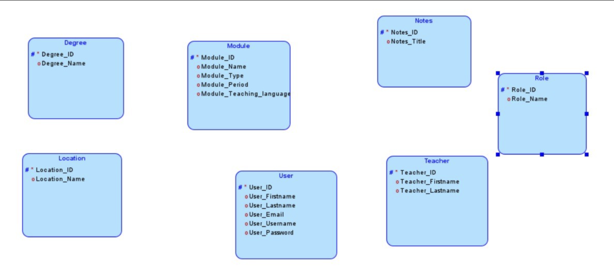

# Floorball_Statistics_Project 


[](http://www.apache.org/licenses/LICENSE-2.0.html)


#### Contents:
- [Analysis](#analysis)
  - [Scenario](#scenario)
  - [User Stories](#user-stories)
  - [Use Case](#use-case)
- [Design](#design)
  - [Prototype Design](#prototype-design)
  - [Domain Design](#domain-design)
  - [Business Logic](#business-logic)
- [Implementation](#implementation)
  - [Backend Technology](#backend-technology)
  - [Frontend Technology](#frontend-technology)
- [Project Management](#project-management)
  - [Roles](#roles)
  - [Milestones](#milestones)

## Analysis

### Scenario

The Floorball-Statistics project is about displaying key information about the Swiss floorball league. 
Our main goal with this web application is to display all the relevant stats of teams and players, 
which are needed for teams to prepare for their upcoming games. The application offers filtered and ranked views of player and team performance, with full data editing capabilities for administrators.

### User Stories
- As a user, I want to view the player stats.
- As a user I want to see the players ranked by league.
- As a user, I want to see the teams.
- As a user, I want to be able to filter the data.
- As an Admin, I want to edit and manage the various data.
- As an Admin, I want the website layout to be structured and easy to follow.
- As an Admin I want the website to be accessible by various devices and ensure compatibility.

### Use Case

We created detailed use case diagrams for each of the three main views in the system. These diagrams define how users and admins interact with the system:

### Use Case 100:

Shows the users available actions for the home page


### Use Case 200:
Shows the users available actions for the player page


### Use Case 300:
Shows the users available actions for the League page


## Design
> 🚧: Keep in mind the Corporate Identity (CI); you shall decide appropriately the color schema, graphics, typography, layout, User Experience (UX), and so on.

Our frontend is designed with usability and clarity in mind. We follow a minimalist layout that supports: 

- Dark, readable typography
- Button-based navigation
- responsive table components
- Input fields for filtering and search

The layout is consistent across apges and follows a clear hierarchy for users and admins.

### Wireframe
> 🚧: It is suggested to start with a wireframe. The wireframe focuses on the website structure (Sitemap planning), sketching the pages using Wireframe components (e.g., header, menu, footer) and UX. You can create a wireframe already with draw.io or similar tools.

The following wireframes define the structure and layout of the three views: Home, Player and League. 
Each wireframe outlines the major UI elements such as filters, search bar, data tables and navigation bar.

### Prototype
> 🚧: A prototype can be designed using placeholder text/figures in Budibase. You don't need to connect the front-end to back-end in the early stages of the project development.

The interactive prototype form Budibase simulates core functionality like: 

- Navigating between home, player and league pages
- Displaying and sorting data in tables
- Using filters and search to dynamically refine results

### Domain Design
> 🚧: Provide a picture and describe your domain model; you may use Entity-Relationship Model or UML class diagram. Both can be created in Visual Paradigm - we have an academic license for it.

The domain model is implemented using JPA entities in the package `ch.fhnw.pizza.data.domain`.

We modeled the core entities based on a real-worlds floorball league structure. The relationships between **Player**, **Team**, **League** and **Ranking** follow standard realtional logic.



### Entities 

- Player: hast attributes like name, last name, goasl, assists and is linked to one team
- Team: contains a list of players and is linked to a league
- League: includes multiple teams and defines the league structure
- Ranking: links teams and leagues with ranking data such as total points and position

The realtionships are: 
- One **Team** to Many **Players**
- One **League** to Many **Teams**
- One **Team** to Many **Rankings**
- One **League** to Many **Rankings**

### Business Logic 
> 🚧: Describe the business logic for **at least one business service** in detail. If available, show the expected path and HTPP method. The remaining documentation of APIs shall be made available in the swagger endpoint. The default Swagger UI page is available at /swagger-ui.html.

We implemented the business logic in the `ch.fhnw.pizza.business.service` package. Each service class handels the core application logic for its respective entitity.

Below is an example of the business logic for managing player data. 

### PlayerService

This service provides full CRUD operations for `Player` objects, including logic to update only provided fields:

- **GET** `/api/players`
  -> returns all players in the system

- **GET** `/api/players/{id}`
  -> returns one player by ID.
  -> Throws a runtime exception if the ID does not exist.

- **POST** `/api/players`
  -> Adds a new player to the system.  
  -> Validates inpnut and links the player to a team.

- **PUT** `/api/players/{id}`
  -> Updates an existing player.
  -> Only updates fields that are explicitly provided in the request body.

- **DELETE** `/api/players/{id}`
  -> Deletes a player by ID
  -> Throws a runtime exception if the player does not exist.

### Example: Update Logic

java 
if (player.getName() != null) {
	existingPlayer.setName(player.getName());
}
if (player.getGoals() != 0) {
	existingPlayer.setGoals(player.getGoals());
}

## Implementation
> 🚧: Briefly describe your technology stack, which apps were used and for what.

The application is structured following a layered architecture: 

- **Controller Layer**: Exposes REST endpoints for PLayers, Teams, Leagues and Rankings.
- **Service Layer**: Handles business logic, input validation and entity updates.
- **Repository Layer**: Connects to the database using Spring Data JPA.

This separation makes the code modular, testable and easier to maintain.

### Backend Technology
> 🚧: It is suggested to clone this repository, but you are free to start from fresh with a Spring Initializr. If so, describe if there are any changes to the PizzaRP e.g., different dependencies, versions & etc... Please, also describe how your database is set up. If you want a persistent or in-memory H2 database check [link](https://github.com/FHNW-INT/Pizzeria_Reference_Project/blob/main/pizza/src/main/resources/application.properties). If you have placeholder data to initialize at the app, you may use a variation of the method **initPlaceholderData()** available at [link](https://github.com/FHNW-INT/Pizzeria_Reference_Project/blob/main/pizza/src/main/java/ch/fhnw/pizza/PizzaApplication.java).

The backend is built using **Java 17** and **Spring Boot**, initialized via [Spring Inititializr](https://start.spring.io/). The following key dependencies are used: 

- **Spring Web**: to create RESTful web services.
- **Spring Data JPA**: For easy data access using repositories.
- **H2 Database**: in-memory development database for fast testing.
- **Swagger/OpenAI**: to automatically generate and expose API documentation.

Then, the following further dependencies have been added to the project `pom.xml`:

- DB:
```XML
<dependency>
			<groupId>com.h2database</groupId>
			<artifactId>h2</artifactId>
			<scope>runtime</scope>
</dependency>
```

- SWAGGER:
```XML
   <dependency>
      <groupId>org.springdoc</groupId>
      <artifactId>springdoc-openapi-starter-webmvc-ui</artifactId>
      <version>2.3.0</version>
   </dependency>
```

### Frontend Technology
> 🚧: Describe your views and what APIs is used on which view. If you don't have access to the Internet Technology class Budibase environment(https://inttech.budibase.app/), please write to Devid on MS teams.

The frontend was created using Budibase. It follows a modular structure based on three main pages: 

- **Home Page (Use Case 100)**
  The homepage allows users to:
  - Search for teams or players
  - Navigate to the Player View and League View using UI buttons

 - **Player Page (Use Case 200)**
   The player page view presents a table listing all players and their statistics.
   Users can:
   - Filter and sort statistics
   - Search for specific players
   Admins can
   - Add, alter or delete player data via the connected backend API

   APIs used:
   - `GET /api/players`
   - `POST /api/players`
   - `PUT /api/players/{id}`
   - `DELETE /api/player/{id}`

- **League Page (Use Case 300)**
  The league view shows rankings and team performance statistics.
  Users can:
  - View and fitler rankings
  - Navigate back to home or Player pages
  Admins can:
  - Add, alter or delete rankings, teams and leagues

  APIs used:
  - `GET /api/leagues`
  - `GET /api/rankings`
  - `GET /api/teams`
  - and the corresponding `POST`, `PUT`, `DELETE` endpoints

## Execution
> 🚧: Please describe how to execute your app and what configurations must be changed to run it. 

To run the full-stack application, follow these steps:

#### Backend Setup

1. **Clone the Repository**  
   Clone your GitHub project repository that contains the Spring Boot application.

2. **Start Codespace / IDE**  
   Open the project in your IDE (e.g., IntelliJ or VS Code). Alternatively, start a GitHub Codespace.

3. **Run the Application**  
   Execute the `main()` method in `FloorballStatisticsApplication.java`.  
   The backend will start at: `http://localhost:8080/`

4. **Set Public Port (if using Codespaces)**  
   - Expose port 8080 publicly so the Budibase frontend can fetch data.
   - In GitHub Codespaces: Click **Port 8080 > Make Public**

#### Frontend (Budibase) Setup

1. **Access Budibase**  
   Log in at [https://inttech.budibase.app](https://inttech.budibase.app)

2. **Create Your App**  
   - Either import the existing Pizzeria app or start a new app.
   - Connect your app’s Data Source to your Spring Boot backend URL.

3. **Update Data Source URL**  
   If your backend is running on a different public URL (e.g. from Codespaces), update it in:
   - `Data > External Data Sources > Your API > Base URL`

4. **Publish the App**  
   Click **Publish** in Budibase to deploy your app and test the live connection.

### Deployment to a PaaS
> 🚧: Deployment to PaaS is optional but recommended as it will make your application (backend) accessible without server restart and through a unique, constantly available link.  

Alternatively, you can deploy your application to a free PaaS like [Render](https://dashboard.render.com/register).
1. Refer to the Dockerfile inside the application root (FHNW-INT/Pizzeria_Reference_Project/pizza).
2. Adapt line 13 to the name of your jar file. The jar name should be derived from the details in the pom.xml as follows:<br>
`{artifactId}-{version}.jar` 
2. Login to Render using your GitHub credentials.
3. Create a new Web Service and choose Build and deploy from a Git repository.
4. Enter the link to your (public) GitHub repository and click Continue.
5. Enter the Root Directory (name of the folder where pom.xml resides).
6. Choose the Instance Type as Free/Hobby. All other details are default.
7. Click on Create Web Service. Your app will undergo automatic build and deployment. Monitor the logs to view the progress or error messages. The entire process of Build+Deploy might take several minutes.
8. After successful deployment, you can access your backend using the generated unique URL (visible on top left under the name of your web service).
9. This unique URL will remain unchanged as long as your web service is deployed on Render. You can now integrate it in Budibase to make API calls to your custom endpoints.

## Project Management
> 🚧: Include all the participants and briefly describe each of their **individual** contribution and/or roles. Screenshots/descriptions of your Kanban board or similar project management tools are welcome.

### Roles
- Back-end developer: Charuta Pande 
- Front-end developer: Devid Montecchiari

### Milestones
1. **Analysis**: Scenario ideation, use case analysis and user story writing.
2. **Prototype Design**: Creation of wireframe and prototype.
3. **Domain Design**: Definition of domain model.
4. **Business Logic and API Design**: Definition of business logic and API.
5. **Data and API Implementation**: Implementation of data access and business logic layers, and API.
6. **Security and Frontend Implementation**: Integration of security framework and frontend realisation.
7. (optional) **Deployment**: Deployment of Web application on cloud infrastructure.


#### Maintainer
- Charuta Pande
- Devid Montecchiari

#### License
- [Apache License, Version 2.0](blob/master/LICENSE)
